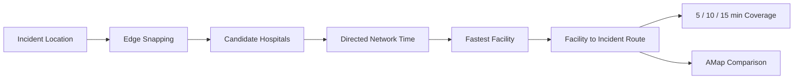
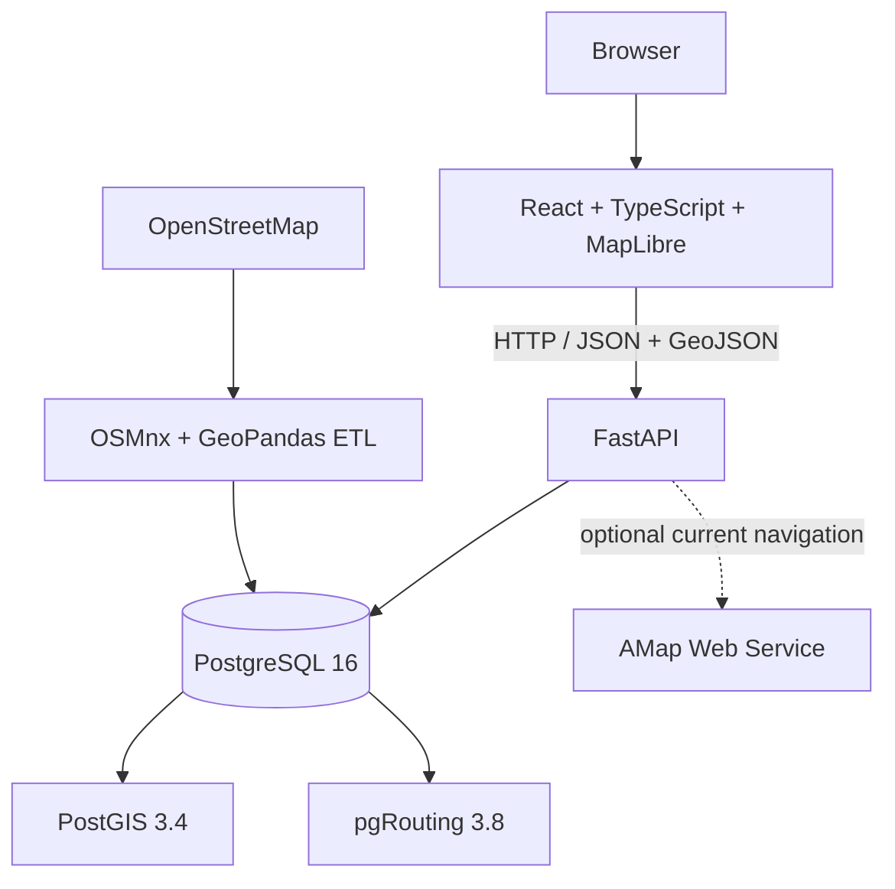

# CityScope

[English](README_EN.md) | 中文

**城市空间智能分析与应急响应平台**

CityScope 是一个基于真实 OpenStreetMap 数据构建的 WebGIS 城市空间分析与路网决策系统。它以兰州连续主城区及周边建成区为示范区，通过 PostGIS、pgRouting、FastAPI、React 和 MapLibre GL JS 提供有向路径规划、网络设施选择、可达圈、应急响应和步行生活圈分析。

**Current Status: Core project completed**

## Overview

CityScope 将 OSM 道路、建筑与 POI 转换为可复现的空间数据库和独立的机动车、步行路网。浏览器端负责地图交互与结果表达，FastAPI 组织空间查询，PostGIS 处理几何，pgRouting 计算真实有向拓扑上的网络成本。高德 Web Service 作为可选的当前导航对照，不参与 CityScope 路由求解。

示范区范围为 `(103.60, 35.98, 104.08, 36.16)`，数据坐标系为 EPSG:4326。该范围用于展示城市空间分析流程，不代表完整兰州市行政辖区。

## Key Capabilities

- 有向机动车最短时间路径
- 基于网络时间的最近设施检索
- 5 / 10 / 15 分钟机动车可达圈
- 医疗与消防应急响应分析
- 独立步行路网的 15 分钟生活圈
- 任意地图点 Edge Snapping 与部分 edge 成本
- POI、道路、建筑与分析结果专题可视化
- MapLibre 2D 与 2.5D/3D 建筑视图
- CityScope 静态基准与高德当前导航对照

## Scenario: Urban Emergency Response

一个真实可复现的兰州医疗事件案例展示了为什么设施选择需要网络分析。事件点 `(103.783489, 36.058598)` 吸附到道路 edge 8,884，吸附距离为 6.1 m。直线最近设施是甘肃省肿瘤医院；按 `facility → incident` 有向网络时间最快的设施则是七里河区中药医院。



| Result | Value |
| --- | ---: |
| Recommended facility | 七里河区中药医院 |
| Response route | 2,003.0 m |
| CityScope static ETA | 218.3 s / 3.64 min |
| 5 / 10 / 15 min coverage | 4.060 / 32.002 / 111.626 km² |

这个结果表明，空间距离最近不等于有向道路网络中的响应时间最短。案例的候选排序、Edge Snapping、路线、覆盖范围、API 请求和高德对照见 [兰州市城市应急响应分析](docs/scenario-emergency-response.md)。

## Static Routing vs Current Navigation

同一案例、同一 `facility → incident` 方向的实测结果如下。高德数据采集于 2026-09-10 16:21（Asia/Shanghai），再次请求时会随导航环境变化。

| Metric | CityScope Static Baseline | AMap Current Navigation |
| --- | ---: | ---: |
| Distance | 2,003.0 m | 2,027.0 m |
| ETA | 3.64 min | 9.38 min |
| Average speed | 33.03 km/h | 12.96 km/h |

CityScope 使用 OSM、pgRouting 与校准后的静态有效速度，表达稳定的道路网络基准。高德返回当前导航估计。本次差异同时可能来自交通状态、信号灯、路线选择、路口条件与导航模型，不能直接定义为纯拥堵延误。实现与验证记录见 [AMap current navigation comparison](docs/amap-traffic-comparison.md)。

## System Architecture



| Layer | Technology |
| --- | --- |
| Frontend | React 19, TypeScript, Vite 6, Axios, MapLibre GL JS 6 |
| Backend | Python 3.12, FastAPI, Pydantic, SQLAlchemy, GeoAlchemy2, Psycopg |
| GIS | PostgreSQL 16, PostGIS 3.4, pgRouting 3.8, OSMnx, GeoPandas, Shapely, pyproj |
| Engineering | Docker Compose, pytest, Git |

## GIS and Routing Design

- **Directed routing** — 机动车查询保持 `directed = true` 与 `reverse_cost = -1`；双向道路由两条方向相反的真实 edge 表示。
- **Static effective speed** — OSM `maxspeed` 作为上限，实际路由速度按 highway 类型校准。当前 `speed_kph` 的中位数为 20.00、均值为 23.88、P90 为 30.00 km/h。
- **Edge Snapping** — 任意点投影到最近可路由 edge，`pgr_withPoints` 系列函数从 edge 内部位置计算首尾部分成本。39 条 self-loop 保留在原始图中，但不参与 snapping。
- **Connector metadata** — 原始点到投影点的 `snap_distance_m` 只作为元数据，不加入机动车距离或 ETA。
- **Network facility selection** — 设施与查询点均使用 edge 位置，候选按有向网络通行时间排序。
- **Emergency direction** — 应急车辆路线固定为 `facility → incident`，不把反向查询视为等价结果。
- **Motor isochrone** — `pgr_withPointsDD` 计算 5 / 10 / 15 分钟可达节点，Concave Hull 只负责地图边界表达。
- **Pedestrian separation** — 生活圈使用独立步行路网；4.8 km/h 静态速度与起点、POI connector 共同组成总步行时间。

Edge Snapping 的方向处理和已知边界见 [Edge Snapping](docs/edge-snapping.md)。

## Data

以下数量于 2026-09-10 从当前 PostGIS 数据库重新核实：

| Dataset | Records |
| --- | ---: |
| Raw motor road edges | 18,441 |
| Routable directed motor edges | 18,439 |
| Motor road nodes | 8,286 |
| Pedestrian directed edges | 59,542 |
| Pedestrian nodes | 23,195 |
| Buildings | 30,011 |
| POIs | 2,308 |

道路、建筑和 POI 均来自 OpenStreetMap。下载缓存位于 `data/raw/osm/`，清洗产物位于 `data/interim/osm/`，两者默认不提交到 Git。

## API

FastAPI 默认运行在 `http://localhost:8000`，交互文档位于 `/docs`。

| Method | Endpoint | Purpose |
| --- | --- | --- |
| `GET` | `/api/v1/health` | 服务与数据库状态 |
| `POST` | `/api/v1/routing/shortest-path` | Edge-snapped 有向最短时间路径 |
| `GET` | `/api/v1/routing/nearest-facility` | 按网络时间检索设施 |
| `GET` | `/api/v1/routing/isochrone` | 机动车 5 / 10 / 15 分钟可达圈 |
| `POST` | `/api/v1/emergency/response` | 医疗或消防响应设施、路线与覆盖范围 |
| `POST` | `/api/v1/routing/traffic-comparison` | CityScope 静态路线与高德当前导航对照 |
| `POST` | `/api/v1/living-circle/analyze` | 15 分钟步行生活圈与可达 POI |

## Testing

```powershell
cd backend
..\.venv\Scripts\python.exe -m pytest -q
cd ..\frontend
npm run build
```

当前验收基准：

- Backend tests: **172 passed**
- Frontend production build: **PASS**
- PostgreSQL / PostGIS: **healthy**
- Browser smoke test: **PASS**
- Browser console errors: **0**

最终验证记录见 [Final Validation](docs/final-validation.md)。

## Project Structure

```text
frontend/    React、MapLibre 地图工作台与 API 客户端
backend/     FastAPI 接口、数据模型、路由与空间分析服务
database/    PostGIS/pgRouting 镜像、初始化 SQL 与迁移
scripts/     OSM 数据构建、路网成本、接驳映射与验证脚本
docs/        案例、数据、算法、性能和验收记录
data/        示例数据以及被 Git 忽略的本地 OSM 缓存
screenshots/ 可选的项目展示素材目录
```

## Local Setup

以下流程已在 Windows 11、Python 3.12、Node.js 24 与 Docker Desktop 环境验证。

```powershell
git clone https://github.com/yeshushahua/CityScope.git
cd CityScope
Copy-Item .env.example .env
Copy-Item frontend/.env.example frontend/.env
py -3.12 -m venv .venv
.\.venv\Scripts\python.exe -m pip install -r backend/requirements.txt
.\.venv\Scripts\python.exe -m pip install -r scripts/osm/requirements.txt
cd frontend
npm ci
cd ..
docker compose up --build -d postgres
```

后端：

```powershell
cd backend
..\.venv\Scripts\python.exe -m uvicorn app.main:app --reload --host 0.0.0.0 --port 8000
```

前端（另开终端）：

```powershell
cd frontend
npm run dev
```

访问 `http://localhost:5173`。本地配置来自根目录 `.env` 和 `frontend/.env`，这两个文件已被 Git 忽略。高德对照功能需要在根目录 `.env` 中配置 `AMAP_WEB_SERVICE_KEY`；Key 只由后端读取。

### Build the local OSM dataset

数据库就绪后，在项目根目录依次运行：

```powershell
.\.venv\Scripts\python.exe scripts/osm/prepare_lanzhou.py --replace
.\.venv\Scripts\python.exe scripts/osm/build_pedestrian_network.py --replace
.\.venv\Scripts\python.exe scripts/osm/enrich_building_heights.py
```

仅从现有缓存重新生成机动车有效速度与成本：

```powershell
.\.venv\Scripts\python.exe scripts/osm/rebuild_motor_routing.py
```

数据库和脚本说明见 [Backend Guide](backend/README.md) 与 [Database Guide](database/README.md)。

## Documentation

- [Urban Emergency Response Analysis in Lanzhou](docs/scenario-emergency-response.md)
- [Edge Snapping](docs/edge-snapping.md)
- [AMap Current Navigation Comparison](docs/amap-traffic-comparison.md)
- [Final Validation](docs/final-validation.md)
- [Development validation records](docs/)

## Known Limitations

- 机动车时间是静态道路等级速度基准，不表示实时交通或真实出警时间。
- 步行时间采用 4.8 km/h 静态速度。
- Edge Snapping 不使用航向、车道、GPS 历史或高架层级进行高级地图匹配。
- Isochrone 边界是可达网络节点的空间近似。
- 建筑高度受 OSM `height` 与 `building:levels` 标签完整度限制。

## Data Attribution

道路、机动车与步行网络、建筑和 POI：**© OpenStreetMap contributors**。默认底图由 OpenFreeMap 提供，页面保留 OpenFreeMap、OpenMapTiles 与 OpenStreetMap attribution。

## License

项目代码采用 [MIT License](LICENSE)。OpenStreetMap 数据及第三方底图和服务遵循各自的许可与使用条款。
