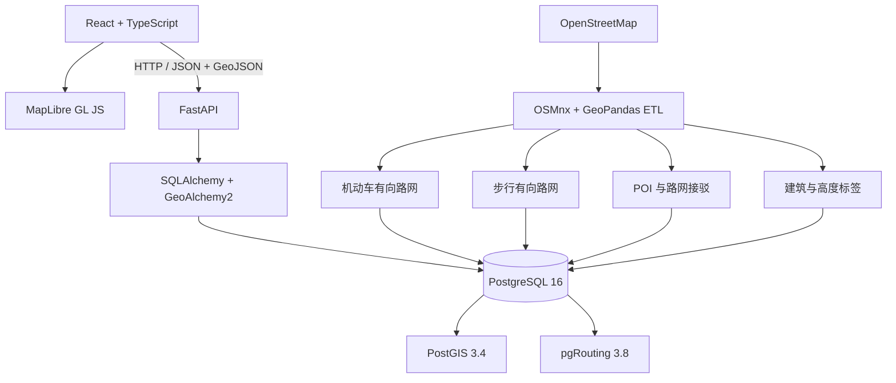

# CityScope

**城市空间智能分析与应急响应平台**

**Current Status: Core project completed**

CityScope 是一个基于真实 OpenStreetMap 数据构建的城市空间智能分析平台。项目以兰州市连续主城区及周边建成区为示范区，通过 React、MapLibre、FastAPI、PostGIS 与 pgRouting，提供机动车和步行网络分析、路径规划、可达圈、应急响应、15 分钟生活圈及 2.5D 城市可视化。

示范区范围为 `(103.60, 35.98, 104.08, 36.16)`，数据坐标系为 EPSG:4326。该范围用于展示城市空间分析流程，不代表完整兰州市行政辖区。

## 核心能力

- 真实 OSM 数据到 PostGIS 的可复现数据链
- PostGIS 视窗加载、邻近查询和范围统计
- 有向机动车路网与静态时间成本
- 点到点最短时间路径与最近设施检索
- CityScope 静态路线与高德当前驾车导航 ETA 对照
- 5 / 10 / 15 分钟机动车 Isochrone
- 医疗与消防应急响应决策支持
- 独立 OSM 步行路网与 15 分钟生活圈
- POI、建筑、路网和分析结果专题可视化
- MapLibre 原生 2D 与 2.5D/3D 建筑视图

## 系统架构



## 技术栈

| 层级 | 技术 |
| --- | --- |
| Frontend | React 19、TypeScript、Vite 6、Axios、MapLibre GL JS 6 |
| Backend | Python 3.12、FastAPI、Pydantic、SQLAlchemy、GeoAlchemy2、Psycopg |
| GIS | PostgreSQL 16、PostGIS 3.4、pgRouting 3.8、OSMnx、GeoPandas、Shapely、pyproj |
| Engineering | Docker Compose、pytest、Git |

## 数据规模

当前示范数据集已经过真实数据库验证：

| 数据 | 数量 |
| --- | ---: |
| 机动车节点 | 8,286 |
| 机动车有向边 | 18,439 |
| 步行节点 | 23,195 |
| 步行有向边 | 59,542 |
| 建筑 | 30,011 |
| POI | 2,308 |

## 核心算法

### 路径规划

地图点先吸附到道路顶点，再以静态通行时间为成本调用 `pgr_dijkstra`，并设置 `directed => true` 保留机动车单行约束。机动车有效速度按 highway 类型设定；可解析的 OSM `maxspeed` 作为上限约束参与 `min(maxspeed, highway effective speed)`，不会直接作为连续行驶速度。

```text
vertex snapping → pgr_dijkstra → directed=true → static travel-time cost
```

### Current navigation comparison

点到点结果同时展示 **CityScope 静态道路模型**与**高德当前导航估计**的距离、ETA 和平均速度差异，并汇总高德 TMC 路况构成。地图路线始终来自 CityScope；高德只作为可选对照源，其超时、限额或配置错误不会中断原有路径结果。

高德 Web 服务只由 FastAPI 调用。使用前在根目录 `.env` 配置 `AMAP_WEB_SERVICE_KEY`，不要将真实 Key 写入前端或提交到 Git。实现与实测记录见 [docs/amap-traffic-comparison.md](docs/amap-traffic-comparison.md)。

### 最近设施

设施和查询点分别映射到路网顶点，通过 `pgr_dijkstraCost` 计算网络时间并排序；不可达设施不会被误判为最近设施。

### Isochrone

一次 `pgr_drivingDistance` 查询得到最大时限内的可达节点，再按 5 / 10 / 15 分钟分组，使用 PostGIS Concave Hull 生成合法、嵌套的近似边界。

### 应急响应

响应方向为 `facility → incident`。系统从医疗或消防设施出发，按有向路网时间选择候选设施，同时返回推荐路线与 5 / 10 / 15 分钟服务范围。

### 15 分钟生活圈

生活圈使用独立的 OSM walk network。总时间由居住点接驳时间、路网时间和 POI 接驳时间组成，统一采用 4.8 km/h 静态步行速度。

```text
origin connector + network time + POI connector
```

POI 可达性按网络总时间判断；Concave Hull 只用于地图表达，不以 Polygon Contains 作为设施资格依据。

## 快速启动

以下流程已在 Windows 11、Python 3.12、Node.js 24 与 Docker Desktop 环境中验证。

```powershell
git clone https://github.com/yeshushahua/CityScope.git
cd CityScope
Copy-Item .env.example .env
Copy-Item frontend/.env.example frontend/.env
py -3.12 -m venv .venv
.\.venv\Scripts\python.exe -m pip install -r backend/requirements.txt
.\.venv\Scripts\python.exe -m pip install -r scripts/osm/requirements.txt
cd frontend
npm ci
cd ..
```

启动 PostgreSQL、PostGIS 与 pgRouting：

```powershell
docker compose up --build -d postgres
docker compose ps
```

后端：

```powershell
cd backend
..\.venv\Scripts\python.exe -m uvicorn app.main:app --reload --host 0.0.0.0 --port 8000
```

前端（另开终端）：

```powershell
cd frontend
npm run dev
```

访问 `http://localhost:5173`。本地开发配置来自根目录 `.env` 和 `frontend/.env`；这两个文件已被 Git 忽略，部署时应替换示例密码。

## 首次数据初始化

数据库容器首次启动时会启用 PostGIS 与 pgRouting。随后在项目根目录按以下顺序构建真实 OSM 数据：

```powershell
.\.venv\Scripts\python.exe scripts/osm/prepare_lanzhou.py --replace
.\.venv\Scripts\python.exe scripts/osm/build_pedestrian_network.py --replace
.\.venv\Scripts\python.exe scripts/osm/enrich_building_heights.py
```

仅需从现有缓存重新生成机动车有效速度与成本时，可运行：

```powershell
.\.venv\Scripts\python.exe scripts/osm/rebuild_motor_routing.py
```

该脚本会先核对缓存道路与数据库 `road_edges` 一致，再事务性替换 `routing_edges`，不会重建 POI 或步行网络。

脚本执行顺序对应：基础表与迁移、机动车 OSM ETL、POI/建筑导入、机动车 routing network、POI 机动车接驳、独立步行网络、POI 步行接驳、建筑高度补充。下载缓存位于 `data/raw/osm/`，清洗产物位于 `data/interim/osm/`，均不会提交到 Git。

更详细的数据库和脚本说明见 [backend/README.md](backend/README.md) 与 [database/README.md](database/README.md)。

## 测试与验证

```powershell
cd backend
..\.venv\Scripts\python.exe -m pytest -q
cd ..\frontend
npm run build
```

最终验收结果：

- Backend tests: **162 passed**
- Frontend production build: **PASS**
- PostgreSQL / PostGIS: **healthy**
- Browser smoke test: **PASS**
- Browser console errors: **0**

最终记录见 [docs/final-validation.md](docs/final-validation.md)。各阶段的算法与数据验证记录保留在 [docs/](docs/) 和 Git history 中。

## 目录说明

```text
frontend/    React、MapLibre 地图工作台与 API 客户端
backend/     FastAPI 接口、数据模型和空间分析服务
database/    PostGIS/pgRouting 镜像、初始化 SQL 与迁移
scripts/     OSM 数据构建、接驳映射与验证脚本
docs/        数据、算法、性能和最终验收记录
screenshots/ 可选的项目展示素材目录
```

## 数据来源与 Attribution

道路、机动车与步行网络、建筑和 POI 均来自真实 OpenStreetMap 数据：**© OpenStreetMap contributors**。

默认底图由 OpenFreeMap 提供，页面保留 OpenFreeMap、OpenMapTiles 与 OpenStreetMap attribution。数据完整性受 OpenStreetMap 社区标注覆盖程度影响。

## 已知限制

- 机动车时间基于道路等级的静态速度，不含实时交通。
- 步行时间采用 4.8 km/h 静态速度。
- 路径端点使用 vertex snapping，尚未使用 edge-position map matching。
- Isochrone 是基于可达节点生成的空间近似边界。
- 建筑高度主要受 OSM `height` 与 `building:levels` 标签完整度限制。
- CityScope 是空间决策演示项目，不是真实应急调度系统。
