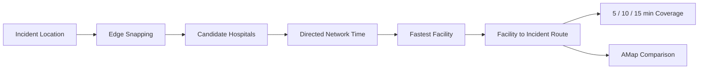
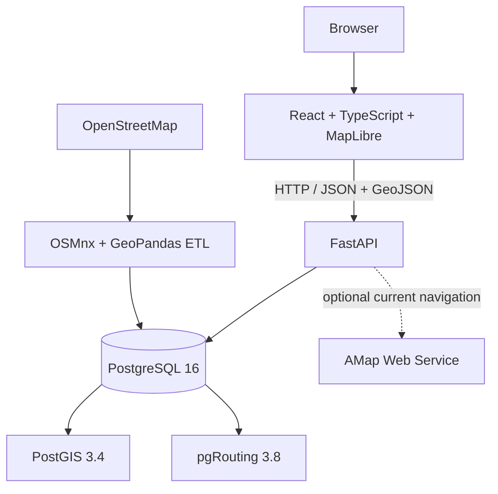

# CityScope

English | [中文](README.md)

**Urban Spatial Intelligence and Emergency Response Platform**

CityScope is a WebGIS urban spatial analysis and road-network decision-support system built on real OpenStreetMap data. Using Lanzhou's continuous urban area and surrounding built-up zones as its study area, it combines PostGIS, pgRouting, FastAPI, React, and MapLibre GL JS to provide directed routing, network-based facility selection, isochrones, emergency response analysis, and pedestrian accessibility analysis.

**Current Status: Core project completed**

## Overview

CityScope transforms OSM roads, buildings, and POIs into a reproducible spatial database with separate motor-vehicle and pedestrian networks. The browser handles map interaction and result visualization, FastAPI coordinates spatial queries, PostGIS processes geometry, and pgRouting calculates network costs over the real directed topology. AMap Web Service is an optional external reference for current navigation conditions; it does not participate in CityScope's route calculation.

The demonstration dataset covers `(103.60, 35.98, 104.08, 36.16)` in EPSG:4326. This extent supports the spatial-analysis workflow and does not represent the complete administrative area of Lanzhou.

## Key Capabilities

- Directed shortest-time routing for motor vehicles
- Nearest-facility search based on network travel time
- 5 / 10 / 15-minute motor-vehicle isochrones
- Medical and fire emergency response analysis
- 15-minute walking accessibility over a separate pedestrian network
- Edge snapping for arbitrary map points with partial-edge costs
- Thematic visualization of POIs, roads, buildings, and analysis results
- MapLibre 2D and 2.5D/3D building views
- Comparison between the CityScope static baseline and AMap current navigation

## Scenario: Urban Emergency Response

A reproducible medical-emergency scenario in Lanzhou demonstrates why facility selection requires network analysis. The incident at `(103.783489, 36.058598)` snaps to road edge 8,884 at a distance of 6.1 m. The nearest facility by straight-line distance is Gansu Provincial Cancer Hospital (`甘肃省肿瘤医院`), while the fastest facility under directed `facility → incident` network travel time is `七里河区中药医院`.



| Result | Value |
| --- | ---: |
| Recommended facility | Qilihe District Traditional Chinese Medicine Hospital* |
| Response route | 2,003.0 m |
| CityScope static ETA | 218.3 s / 3.64 min |
| 5 / 10 / 15-minute coverage | 4.060 / 32.002 / 111.626 km² |

\* “Qilihe District Traditional Chinese Medicine Hospital” is a descriptive English translation of the source OSM name `七里河区中药医院`, not a claimed official English institution name.

The result shows that the closest facility in geographic space is not necessarily the fastest one over a directed road network. See [Urban Emergency Response Analysis in Lanzhou](docs/scenario-emergency-response-en.md) for the candidate ranking, edge-snapping result, response route, coverage areas, API requests, and AMap comparison.

## Static Routing vs Current Navigation

The following results use the same scenario and the same `facility → incident` direction. AMap data was captured at 2026-09-10 16:21 (Asia/Shanghai) and may change when the request is repeated under different navigation conditions.

| Metric | CityScope Static Baseline | AMap Current Navigation |
| --- | ---: | ---: |
| Distance | 2,003.0 m | 2,027.0 m |
| ETA | 3.64 min | 9.38 min |
| Average speed | 33.03 km/h | 12.96 km/h |

CityScope provides a stable road-network baseline using OSM, pgRouting, and calibrated static effective speeds. AMap provides an estimate under current navigation conditions. The observed difference may reflect traffic conditions, traffic signals, route selection, intersection effects, coordinate conversion, and differences between the navigation models; it must not be interpreted solely as congestion delay. Implementation and validation details are available in [AMap Current Navigation Comparison](docs/amap-traffic-comparison.md).

## System Architecture



| Layer | Technology |
| --- | --- |
| Frontend | React 19, TypeScript, Vite 6, Axios, MapLibre GL JS 6 |
| Backend | Python 3.12, FastAPI, Pydantic, SQLAlchemy, GeoAlchemy2, Psycopg |
| GIS | PostgreSQL 16, PostGIS 3.4, pgRouting 3.8, OSMnx, GeoPandas, Shapely, pyproj |
| Engineering | Docker Compose, pytest, Git |

## GIS and Routing Design

- **Directed routing** — Motor-vehicle queries use `directed = true` and `reverse_cost = -1`. A bidirectional road is represented by two real edges with opposite directions.
- **Static effective speed calibration** — OSM `maxspeed` is treated as an upper bound, while effective routing speed is calibrated by highway class. The current `speed_kph` distribution has a median of 20.00 km/h, a mean of 23.88 km/h, and a P90 of 30.00 km/h.
- **Edge snapping** — Arbitrary coordinates are projected onto the nearest routable edge. The pgRouting `pgr_withPoints` family calculates the partial-edge cost at route endpoints. The 39 self-loop edges remain in the source graph but are excluded from snapping candidates.
- **Connector metadata** — The off-network distance from a submitted point to its projected point is returned as `snap_distance_m`; it is not added to the motor-vehicle distance or ETA.
- **Network-based facility selection** — Facilities and query points use edge locations, and candidates are ranked by directed network travel time.
- **Facility-to-incident routing** — Emergency response retains the operational direction `facility → incident`; the reverse query is not assumed to be equivalent.
- **Motor-vehicle isochrones** — `pgr_withPointsDD` calculates nodes reachable within 5, 10, and 15 minutes. A Concave Hull is used only to visualize the approximate boundary.
- **Separate pedestrian network** — The walking-accessibility analysis uses an independent pedestrian network. Its total time combines a static 4.8 km/h walking speed with origin and POI connector times.

Direction handling and known edge-snapping limits are documented in [Edge Snapping](docs/edge-snapping.md).

## Data

The following counts were re-verified against the current PostGIS database on 2026-09-10:

| Dataset | Records |
| --- | ---: |
| Raw motor road edges | 18,441 |
| Routable directed motor edges | 18,439 |
| Motor road nodes | 8,286 |
| Pedestrian directed edges | 59,542 |
| Pedestrian nodes | 23,195 |
| Buildings | 30,011 |
| POIs | 2,308 |

Roads, buildings, and POIs come from OpenStreetMap. Download caches are stored under `data/raw/osm/`, and cleaned artifacts are stored under `data/interim/osm/`; both are excluded from Git by default.

## API

FastAPI runs at `http://localhost:8000` by default. Interactive API documentation is available at `/docs`.

| Method | Endpoint | Purpose |
| --- | --- | --- |
| `GET` | `/api/v1/health` | Service and database status |
| `POST` | `/api/v1/routing/shortest-path` | Edge-snapped directed shortest-time route |
| `GET` | `/api/v1/routing/nearest-facility` | Facility search ranked by network travel time |
| `GET` | `/api/v1/routing/isochrone` | 5 / 10 / 15-minute motor-vehicle isochrones |
| `POST` | `/api/v1/emergency/response` | Medical or fire response facility, route, and coverage |
| `POST` | `/api/v1/routing/traffic-comparison` | CityScope static route and AMap current-navigation reference |
| `POST` | `/api/v1/living-circle/analyze` | 15-minute walking accessibility and reachable POIs |

## Testing

```powershell
cd backend
..\.venv\Scripts\python.exe -m pytest -q
cd ..\frontend
npm run build
```

Current validation baseline:

- Backend tests: **172 passed**
- Frontend production build: **PASS**
- PostgreSQL / PostGIS: **healthy**
- Scenario APIs: **HTTP 200**
- Browser smoke test: **PASS**
- Browser console errors: **0**
- `git diff --check`: **PASS**

See [Final Validation](docs/final-validation.md) for the validation record.

## Project Structure

```text
frontend/    React and MapLibre map workspace and API client
backend/     FastAPI endpoints, data models, routing, and spatial-analysis services
database/    PostGIS/pgRouting image, initialization SQL, and migrations
scripts/     OSM data preparation, network costs, connector mapping, and validation
docs/        Scenario, data, algorithm, performance, and validation documentation
data/        Sample data and local OSM caches excluded from Git
screenshots/ Optional project presentation assets
```

## Local Setup

The following workflow has been validated on Windows 11 with Python 3.12, Node.js 24, and Docker Desktop.

```powershell
git clone https://github.com/yeshushahua/CityScope.git
cd CityScope
Copy-Item .env.example .env
Copy-Item frontend/.env.example frontend/.env
py -3.12 -m venv .venv
.\.venv\Scripts\python.exe -m pip install -r backend/requirements.txt
.\.venv\Scripts\python.exe -m pip install -r scripts/osm/requirements.txt
cd frontend
npm ci
cd ..
docker compose up --build -d postgres
```

Start the backend:

```powershell
cd backend
..\.venv\Scripts\python.exe -m uvicorn app.main:app --reload --host 0.0.0.0 --port 8000
```

Start the frontend in another terminal:

```powershell
cd frontend
npm run dev
```

Open `http://localhost:5173`. Local configuration is loaded from the root `.env` and `frontend/.env`; both files are ignored by Git. The AMap comparison requires `AMAP_WEB_SERVICE_KEY` in the root `.env`, and the key is read only by the backend.

### Build the local OSM dataset

After the database is ready, run the following commands from the repository root:

```powershell
.\.venv\Scripts\python.exe scripts/osm/prepare_lanzhou.py --replace
.\.venv\Scripts\python.exe scripts/osm/build_pedestrian_network.py --replace
.\.venv\Scripts\python.exe scripts/osm/enrich_building_heights.py
```

To rebuild only motor-vehicle effective speeds and costs from the existing cache:

```powershell
.\.venv\Scripts\python.exe scripts/osm/rebuild_motor_routing.py
```

Database and script details are available in the [Backend Guide](backend/README.md) and [Database Guide](database/README.md).

## Documentation

- [Urban Emergency Response Analysis in Lanzhou](docs/scenario-emergency-response-en.md)
- [兰州市城市应急响应分析](docs/scenario-emergency-response.md)
- [Edge Snapping](docs/edge-snapping.md)
- [AMap Current Navigation Comparison](docs/amap-traffic-comparison.md)
- [Final Validation](docs/final-validation.md)
- [Development validation records](docs/)

## Known Limitations

- Motor-vehicle travel times are a static road-class speed baseline, not real-time traffic or actual emergency response times.
- Walking time uses a static speed of 4.8 km/h.
- Edge snapping does not use heading, lane information, GPS history, or grade-separated road levels for advanced map matching.
- Isochrone polygons are spatial approximations of reachable road-network nodes.
- Building heights depend on the completeness of OSM `height` and `building:levels` tags.

## Data Attribution

Roads, motor-vehicle and pedestrian networks, buildings, and POIs: **© OpenStreetMap contributors**. The default basemap is provided by OpenFreeMap, and the interface retains attribution for OpenFreeMap, OpenMapTiles, and OpenStreetMap.

## License

Project code is released under the [MIT License](LICENSE). OpenStreetMap data, third-party basemaps, and external services remain subject to their respective licenses and terms of use.
